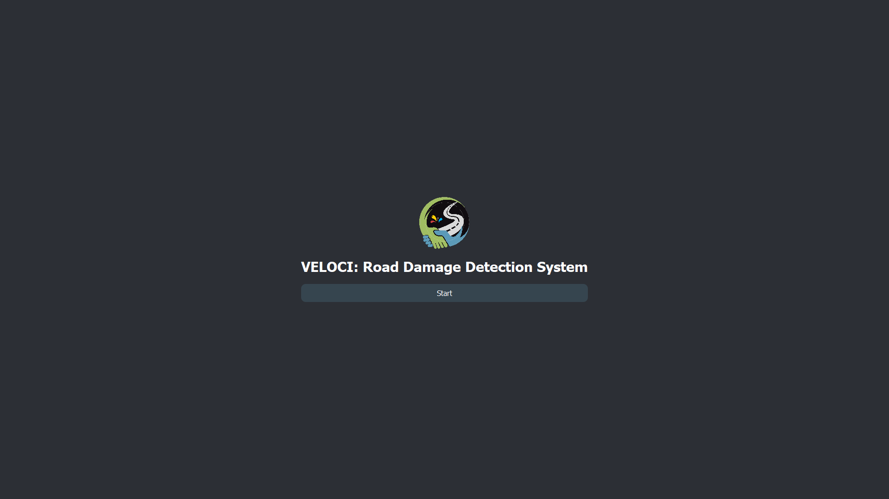
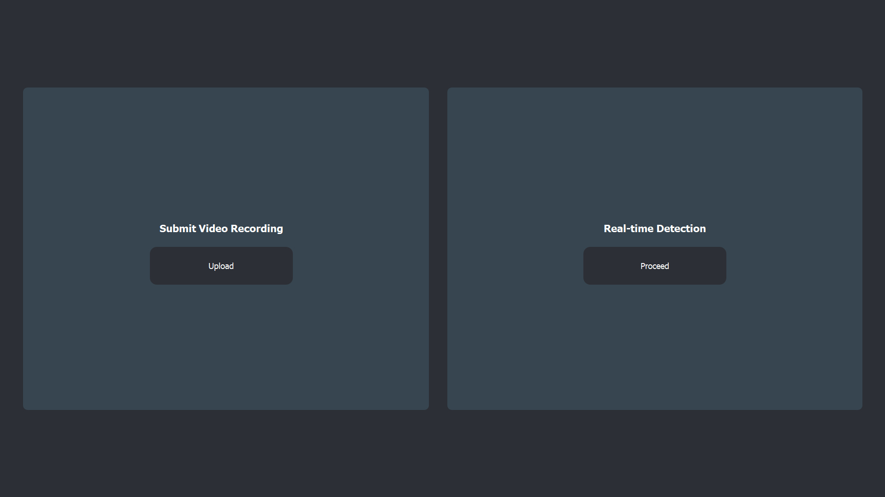
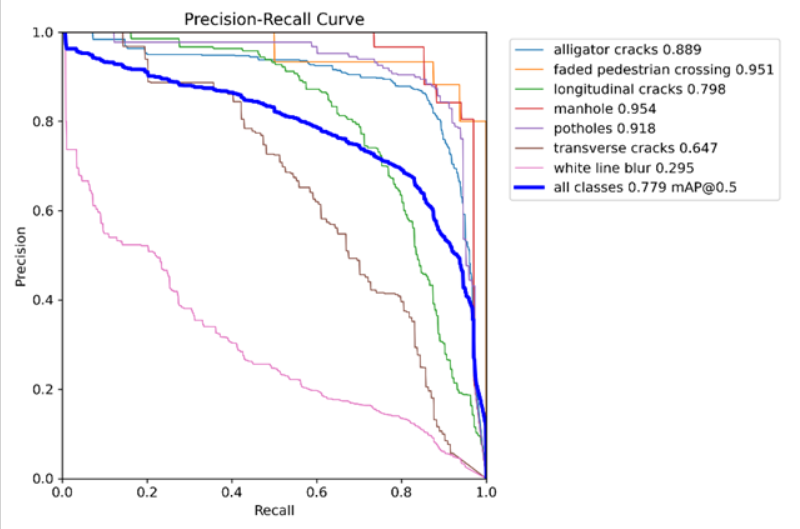
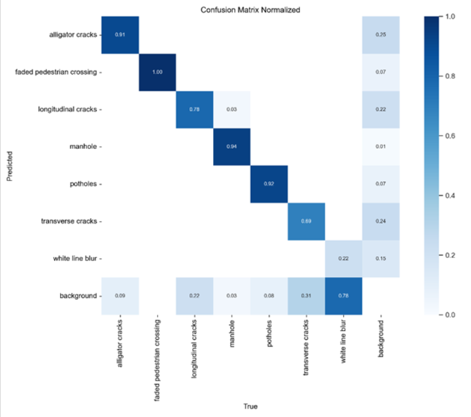

# VelociApp — Desktop Real-Time Road Damage Detection (YOLOv11L)

VelociApp is a **desktop application** for real-time road damage detection using **YOLOv11L** object detection. It processes **live camera/video input** and displays detections with **bounding boxes and confidence scores**, enabling faster and more consistent visual inspection of road conditions.

## Key Features
- Desktop-based interface for **real-time detection**
- Supports **video input / live feed** with on-screen results
- Displays **bounding boxes + confidence score** for each detection
- Detects **7 road damage categories**:
  1. Longitudinal cracks  
  2. Transverse cracks  
  3. Alligator cracks  
  4. Potholes  
  5. White line blur  
  6. Faded pedestrian crossing  
  7. Manhole  

## UI Preview
Below are snapshots of the desktop interface to provide a quick overview of the application flow.

**Home Screen**  

**Mode Selection**  

## Model Selection
Multiple YOLO model sizes were evaluated (YOLOv11m and YOLOv11L). While smaller variants can be faster, they were less consistent for real road scenes in this project. **YOLOv11L** was selected for **better overall detection performance**, with an acceptable speed trade-off when running on GPU.

## Model Results (YOLOv11m vs YOLOv11L)
Two model sizes were evaluated on the validation set.

| Metric | YOLOv11m | YOLOv11L |
|---|---:|---:|
| Best mAP@0.5 | 0.725 | 0.779 |
| Best mAP@0.5:0.95 | 0.390 | 0.429 |
| Best Precision (class) | 0.857 (alligator cracks) | 0.889 (potholes) |
| Best Recall (class) | 0.920 (alligator cracks) | 0.859 (alligator cracks) |
| Worst class (mAP@0.5) | white line blur (0.295) | white line blur (0.295) |
| Inference speed | 16.3 ms/image | 21.9 ms/image |

> Note: YOLOv11L provides higher detection performance, but YOLOv11m is faster. For this application, YOLOv11L was chosen to prioritize detection quality in real road conditions.

## Evaluation Plots (YOLOv11L)
**Precision–Recall Curve**  

**Confusion Matrix (Normalized)**  

## Performance & Hardware
- **Recommended:** NVIDIA GPU (CUDA) for smooth real-time inference
- **CPU Mode:** Supported, but **not suitable for real-time usage** due to lower FPS and slower responsiveness

## Packaging & Deployment
The application is packaged for Windows distribution using:
- **PyInstaller** (bundles the Python application)
- **Inno Setup** (creates an installation package)

## Project Structure
- `src/` — application source code  
- `src/assets/` — UI assets/resources  
- `src/models/` — model weights location  
- `screenshots/` — sample detections and UI previews  

## Additional Screenshots
More screenshots are available in the `screenshots/` folder, including:
- Real-time detection output (`screenshots/demo/demo-realtime.png`)
- Video detection output (`screenshots/demo/demo-video.png`)
- Video upload workflow (`screenshots/demo/ui-video-upload.png`)
- Report generation previews (`screenshots/demo/report-excel.png`, `screenshots/demo/report-pdf.png`)

## Notes
Model weights may be excluded from the repository due to file size.
